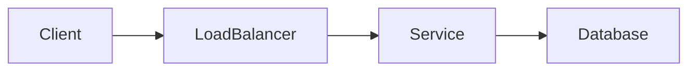

# StackCraft

> **Master System Design with interactive notes, architecture diagrams, real-world case studies, and interview preparation**

StackCraft is an open-source knowledge base designed to help developers learn **System Design** from fundamentals to advanced distributed systems. It combines structured documentation, technical blogs, Mermaid diagrams, and practical case studies into a single searchable website.

---

## Learning Roadmap

```text
Fundamentals
      │
      ▼
Networking
      │
      ▼
Building Blocks
      │
      ▼
Data Storage
      │
      ▼
Distributed Systems
      │
      ▼
Reliability & Scalability
      │
      ▼
System Design Patterns
      │
      ▼
Case Studies
      │
      ▼
Interview Preparation
```

---

## Tech Stack

| Technology | Purpose |
|------------|---------|
| Docusaurus 3 | Documentation framework |
| React 19 | User Interface |
| TypeScript | Type safety |
| Markdown / MDX | Documentation |
| Mermaid | Architecture diagrams |
| Prism | Syntax highlighting |
| Local Search | Full-text search |
| CSS Modules | Styling |
| Node.js + npm | Development environment |
| Vercel | Deployment |

---

## Project Structure

```text
StackCraft
│
├── blog/
│   ├── authors.yml
│   ├── tags.yml
│   └── YYYY-MM-DD-post.md
│
├── docs/
│   ├── fundamentals/
│   ├── networking/
│   ├── building-blocks/
│   ├── data-storage/
│   ├── distributed-systems/
│   ├── reliability/
│   ├── case-studies/
│   └── interview-prep/
│
├── scripts/
├── src/
│   ├── css/
│   └── pages/
│
├── static/
│
├── docusaurus.config.ts
├── sidebars.ts
├── package.json
└── tsconfig.json
```

---

## Getting Started

### Prerequisites

- Node.js **20+**
- npm
- Git

### Clone the Repository

```bash
git clone https://github.com/<your-username>/StackCraft.git

cd StackCraft
```

### Install Dependencies

```bash
npm install
```

### Start the Development Server

```bash
npm start
```

Visit:

```text
http://localhost:3000
```

The website automatically reloads whenever documentation or source files change.

---

## Available Scripts

| Command | Description |
|---------|-------------|
| `npm start` | Start development server |
| `npm run build` | Generate production build |
| `npm run serve` | Preview production build |
| `npm run typecheck` | Run TypeScript checks |
| `npm run clear` | Clear Docusaurus cache |

---

## Production Build

Build the optimized static website:

```bash
npm run build
```

Preview locally:

```bash
npm run serve
```

If Docusaurus keeps stale generated files:

```bash
npm run clear
npm run build
```

---

## Adding Documentation

Create a Markdown file inside the appropriate folder under `docs/`.

Example:

```md
---
title: Load Balancer
sidebar_position: 1
description: Introduction to Load Balancers
---

# Load Balancer

Your documentation goes here.
```

Update `sidebars.ts` if needed to include the new page.

---

## Adding Blog Posts

Create a file:

```text
blog/YYYY-MM-DD-post-title.md
```

Example:

```md
---
title: "CAP Theorem"
description: "Understanding CAP Theorem"
authors: [editorial]
tags: [distributed-systems]
---

Introduction...

<!-- truncate -->

Complete article...
```

Make sure the tags exist in `blog/tags.yml`.

---

## Mermaid Diagrams

StackCraft supports Mermaid diagrams out of the box.

Example:

````md

## Search

StackCraft includes built-in **Local Search**.

The search index includes:

- Documentation
- Blog posts
- Custom pages

The search index is automatically generated during:

```bash
npm run build
```

---

## Documentation Workflow

```text
Write Markdown
       │
       ▼
Add to docs/
       │
       ▼
Update Sidebar
       │
       ▼
Run npm start
       │
       ▼
Preview Changes
       │
       ▼
Commit Changes
       │
       ▼
Open Pull Request
```

---

## Contributing

Contributions are always welcome!

Please read the **[CONTRIBUTING.md](CONTRIBUTING.md)** guide before opening an Issue or Pull Request.

Whether you're fixing a typo, improving documentation, or adding new content, every contribution is appreciated.

---

## License

This project is licensed under the **MIT License**.

---

## Acknowledgements

Built with ❤️ by **Shubham Sebrin**

If you found this project helpful, consider giving it a ⭐ on GitHub and sharing it with others.

**Happy Learning! 🚀**