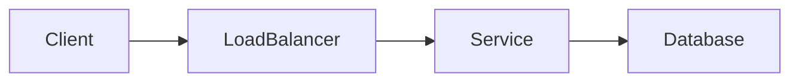

# System Design Notes

A practical, searchable knowledge base for learning system design, scalability, and distributed systems. The website combines structured documentation, technical blog posts, Mermaid architecture diagrams, and real-world case studies.

## Run locally

### Requirements

- Node.js 20 or newer
- npm

Install the dependencies:

```bash
npm install
```

Start the development server:

```bash
npm start
```

Open [http://localhost:3000](http://localhost:3000). Changes to pages and Markdown content are reflected automatically.

### Production build

Generate the optimized static website and search index:

```bash
npm run build
```

Preview the production build locally:

```bash
npm run serve
```

Run the TypeScript check:

```bash
npm run typecheck
```

If Docusaurus retains stale generated data, clear it before rebuilding:

```bash
npm run clear
npm run build
```

## Project architecture

```text
System Design/
├── blog/                       # Dated technical blog posts
│   ├── authors.yml             # Author profiles
│   ├── tags.yml                # Blog category and tag definitions
│   └── YYYY-MM-DD-topic.md     # Individual articles
├── docs/                       # Structured learning documentation
│   ├── fundamentals/
│   ├── networking/
│   ├── building-blocks/
│   ├── data-storage/
│   ├── distributed-systems/
│   ├── reliability/
│   ├── case-studies/
│   └── interview-prep/
├── scripts/
│   └── generate-blog-catalog.mjs  # Generates the 50-post starter catalog
├── src/
│   ├── css/custom.css          # Global theme and documentation styles
│   └── pages/
│       ├── index.tsx           # Custom React homepage
│       └── index.module.css    # Homepage-scoped styles
├── static/img/                 # Logo, favicon, and static images
├── docusaurus.config.ts        # Site, blog, search, Mermaid, navbar, and footer config
├── sidebars.ts                 # Documentation categories and navigation order
├── package.json                # Dependencies and npm commands
└── tsconfig.json               # TypeScript configuration
```

### How the website is assembled

1. Docusaurus reads documentation from `docs/` and blog posts from `blog/`.
2. `sidebars.ts` builds the ordered learning navigation and category pages.
3. `docusaurus.config.ts` configures the theme, Markdown, Mermaid, blog feeds, and local search.
4. React renders the custom homepage while Docusaurus renders Markdown and MDX content.
5. `npm run build` generates static HTML, CSS, JavaScript, feeds, and the full-text search index in `build/`.
6. Vercel serves the generated static website through its global edge network.

## Technology stack

| Technology | Purpose |
| --- | --- |
| Docusaurus 3 | Static documentation and blog framework |
| React 19 | Custom homepage and reusable interface components |
| TypeScript | Typed configuration and React source code |
| Markdown / MDX | Documentation and technical article authoring |
| Mermaid | Architecture, sequence, and data-flow diagrams |
| Prism | Syntax highlighting for code examples |
| Docusaurus Local Search | Browser-side full-text search for docs, pages, and blogs |
| Infima + CSS Modules | Theme foundation and component-scoped styling |
| Node.js + npm | Development, dependency management, and builds |
| Vercel | Static hosting and automatic deployments |

## Content workflow

### Add documentation

Create a Markdown file inside the appropriate directory under `docs/`:

```markdown
---
sidebar_position: 1
title: Topic Title
description: A short summary for search engines.
---

# Topic Title

Article content goes here.
```

The directory must be included in `sidebars.ts` before it appears in the learning navigation.

### Add a blog post

Create `blog/YYYY-MM-DD-post-slug.md`:

```markdown
---
title: "Post title"
description: "Short description"
authors: [editorial]
tags: [architecture, reliability]
---

Introduction shown on the blog index.

<!-- truncate -->

The complete article follows here.
```

Tags must exist in `blog/tags.yml`. The existing starter catalog can be regenerated after editing `scripts/generate-blog-catalog.mjs`:

```bash
node scripts/generate-blog-catalog.mjs
```

### Add a Mermaid diagram

Use a Mermaid code block in any Markdown or MDX file:

````markdown

````

## Search

Local full-text search indexes documentation, blog posts, and custom pages. The index is generated during the production build, so always run `npm run build` after adding or renaming content.