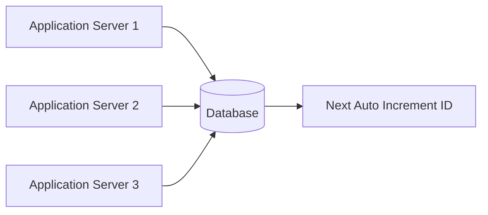
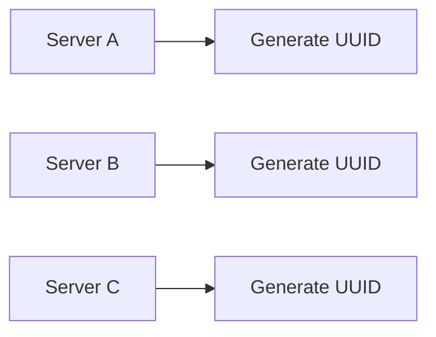
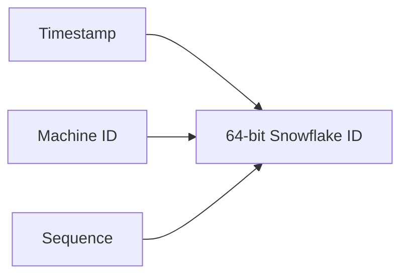
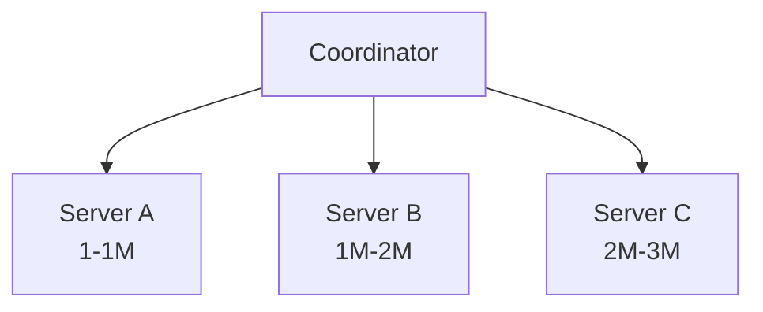

# Designing a Unique ID Generator in Distributed Systems

Generating a unique ID sounds trivial—until your system scales across hundreds or thousands of servers.

Most developers begin with **auto-increment IDs** in a relational database. It works perfectly for a single database instance. But in distributed systems, generating unique identifiers becomes a fundamental design challenge.

Platforms like **Instagram**, **Amazon**, **Uber**, and **WhatsApp** generate millions of new objects every day—users, orders, messages, rides, and payments. Every object must receive a **globally unique identifier**, even when thousands of servers are creating data simultaneously.

The challenge isn't generating numbers.

The challenge is generating **billions of unique, scalable, fault-tolerant, ordered IDs without creating a bottleneck.**

<!-- truncate -->

---

# Why Do We Need Unique IDs?

Every entity inside a system needs a unique identity.

Examples include:

- User IDs
- Order IDs
- Payment IDs
- Message IDs
- Notification IDs
- Ride IDs

Imagine two servers generating the same Order ID.

```
Server A → Order #10567
Server B → Order #10567
```

Now two completely different orders have the same identifier.

This leads to:

- Data corruption
- Lost records
- Broken foreign keys
- Incorrect analytics

Uniqueness is **non-negotiable**.

---

# Approach 1 — Database Auto Increment

The simplest solution is letting the database generate IDs.

```sql
CREATE TABLE orders (
    id BIGINT AUTO_INCREMENT PRIMARY KEY,
    ...
);
```

Every insert automatically gets the next ID.

```
1
2
3
4
5
...
```

## Architecture



## Advantages

- Extremely simple
- Guaranteed uniqueness
- Sequential IDs

## Problems

As traffic grows:

- Every server depends on one database.
- Database becomes a bottleneck.
- Single point of failure.
- Difficult to scale globally.

If the database goes down...

> Nobody can create new records.

---

# Why Not Let Every Server Keep Its Own Counter?

At first glance, this seems obvious.

```
Server A

1
2
3
4
...

Server B

1
2
3
4
...
```

Unfortunately...

```
Server A → ID = 1000

Server B → ID = 1000
```

Collision.

Without coordination, uniqueness cannot be guaranteed.

Distributed systems avoid coordination because coordination is expensive.

---

# Approach 2 — UUID (Universally Unique Identifier)

Instead of coordinating with a central server, every machine generates IDs independently.

Example UUID:

```
550e8400-e29b-41d4-a716-446655440000
```

The probability of collision is astronomically small.

## Architecture



No central authority is required.

## Advantages

- Globally unique
- No coordination
- Highly available
- Easy to generate

## Drawbacks

UUIDs are:

- 128 bits
- Large
- Random
- Not ordered

Random insertion hurts database indexes.

Instead of:

```
1001
1002
1003
1004
```

Databases receive:

```
A91C...
1FF2...
9B2D...
31AC...
```

This causes:

- Index fragmentation
- More page splits
- Poor cache locality
- Slower inserts

---

# Approach 3 — Twitter Snowflake

Twitter introduced one of the most popular distributed ID generators.

Instead of random IDs, it packs several components into a single **64-bit integer**.

## Snowflake Structure

```text
| 1 Bit | 41 Bits | 10 Bits | 12 Bits |
|-------|---------|----------|----------|
| Sign  | Timestamp | Machine ID | Sequence |
```

### Timestamp

Makes IDs naturally ordered.

### Machine ID

Ensures different servers generate different ranges.

### Sequence Number

Allows multiple IDs within the same millisecond.

---

# Snowflake Generation



Example:

```
Timestamp : 1714561234567

Machine ID : 15

Sequence : 89

↓

742913842381092
```

One compact integer.

Globally unique.

Time ordered.

---

# Why Snowflake Is Powerful

Imagine:

```
Server 12

10:00:01.123

↓

ID = 742913842381092
```

Later,

```
Server 15

10:00:01.124

↓

ID = 742913842381500
```

Even though different servers generated the IDs...

The IDs remain approximately ordered.

This makes:

- Analytics easier
- Event replay simpler
- Debugging straightforward

---

# Handling Clock Drift

Distributed systems assume clocks are synchronized.

Reality is different.

Machines drift.

Suppose a server generates:

```
10:00:05
```

Then NTP adjusts its clock backward.

Now the server thinks it's:

```
10:00:03
```

Future IDs suddenly appear **older** than previously generated IDs.

Snowflake implementations detect this and usually:

- Wait until time catches up
- Refuse to generate IDs temporarily
- Use backup sequence logic

---

# Approach 4 — ID Range Allocation

Instead of generating every ID centrally...

A coordinator allocates blocks.

Example:

```
Coordinator

↓

Server A

1 → 1,000,000

↓

Server B

1,000,001 → 2,000,000

↓

Server C

2,000,001 → 3,000,000
```



Each server generates IDs locally until its range is exhausted.

Advantages:

- Less coordination
- Very high throughput
- Simple implementation

Disadvantage:

Eventually servers request another range.

---

# Which Strategy Should You Choose?

| Requirement | Best Choice |
|-------------|------------|
| Small application | Database Sequence |
| Distributed uniqueness | UUID |
| Ordered IDs | Snowflake |
| Maximum throughput | ID Range Allocation |

---

# Interview Question

## Why Not Use Timestamps as IDs?

Suppose two requests arrive simultaneously.

```
10:15:20.123

↓

Request A

10:15:20.123

↓

Request B
```

Both produce exactly the same timestamp.

Collision.

Timestamps alone **cannot guarantee uniqueness**.

They must be combined with:

- Machine ID
- Sequence Number
- Randomness

---

# Predictability Matters

Sequential IDs expose business information.

```
Order

1001

↓

1002

↓

1003
```

A competitor can estimate:

- Daily orders
- Revenue growth
- Customer activity

Randomized identifiers hide this information.

Many public APIs therefore expose UUIDs while internally storing numeric IDs.

---

# Real-World Examples

| Company | Strategy |
|----------|----------|
| Twitter (X) | Snowflake |
| Instagram | Sharded IDs |
| Amazon | Internal distributed IDs |
| Google | UUID / Custom IDs |
| MongoDB | ObjectId |
| PostgreSQL | Sequence / UUID |

---

# Comparison

| Feature | Database Sequence | UUID | Snowflake | ID Range |
|----------|------------------|------|------------|-----------|
| Unique | ✅ | ✅ | ✅ | ✅ |
| Ordered | ✅ | ❌ | ✅ | ✅ |
| Distributed | ❌ | ✅ | ✅ | ✅ |
| No Central Bottleneck | ❌ | ✅ | ✅ | Mostly |
| Easy to Implement | ✅ | ✅ | Medium | Medium |

---

# Key Takeaways

- Generating IDs in a single database is easy.
- Distributed systems require globally unique identifiers.
- UUIDs eliminate coordination but sacrifice ordering.
- Snowflake provides globally unique, time-ordered IDs.
- ID range allocation reduces coordination while maintaining uniqueness.
- Clock synchronization is an important challenge in distributed ID generation.
- The right strategy depends on scalability, ordering, and operational requirements.

---

# Conclusion

At first glance, generating an ID looks like a simple programming task.

In reality, it is a distributed systems problem involving **scalability**, **fault tolerance**, **availability**, **ordering**, and **performance**.

The best solution depends on your system's requirements:

- **Need simplicity?** Use database sequences.
- **Need global uniqueness?** Use UUIDs.
- **Need ordering at massive scale?** Use Snowflake.
- **Need extreme throughput?** Allocate ID ranges.

> **Generating a number is easy. Generating billions of unique, scalable, fault-tolerant, and ordered identifiers across thousands of machines is the real engineering challenge.**

Happy Designing ❤️