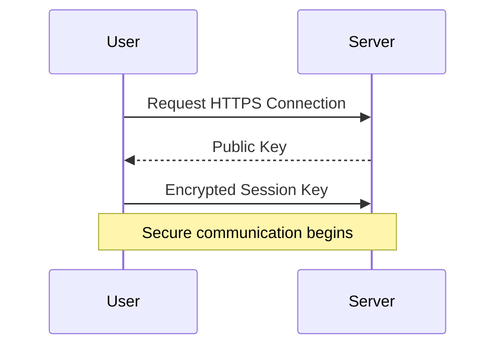

# Encryption Explained Simply

Every day, billions of pieces of sensitive data travel across the internet—passwords, credit card numbers, personal messages, and banking transactions. Encryption is what keeps this data safe from attackers.

## What is Encryption?

Encryption is the process of converting **readable data (plaintext)** into an **unreadable format (ciphertext)** using a mathematical algorithm and a secret key.

```text
Plaintext
    │
    ▼
Encryption + Key
    │
    ▼
Ciphertext
    │
    ▼
Decryption + Key
    │
    ▼
Plaintext
```

Without the correct key, the encrypted data is practically impossible to read.

## Why Do We Need Encryption?

Encryption protects data from:

- Unauthorized access
- Data theft
- Man-in-the-middle attacks
- Identity theft
- Financial fraud

It ensures that even if attackers intercept data, they cannot understand it.

## Types of Encryption

### Symmetric Encryption

The same key is used for encryption and decryption.

Examples:

- AES
- DES
- ChaCha20

**Advantages**

- Extremely fast
- Ideal for encrypting large files

**Disadvantage**

- Securely sharing the key is difficult.

---

### Asymmetric Encryption

Uses two keys:

- Public Key
- Private Key

The public key encrypts data, while only the private key can decrypt it.

Examples:

- RSA
- ECC

This enables secure communication without sharing secret keys.

---

## Where Is Encryption Used?

Encryption powers many everyday applications:

- HTTPS websites
- Online banking
- Password managers
- Messaging apps like WhatsApp
- Cloud storage
- VPNs

Whenever you see a lock icon in your browser, encryption is protecting your connection.

## Encryption in HTTPS



## Encryption vs Hashing

Encryption is reversible with the correct key.

Hashing is one-way and cannot be reversed.

Passwords are usually **hashed**, not encrypted.

## Best Practices

- Use modern algorithms like **AES-256**.
- Never create your own encryption algorithm.
- Rotate encryption keys regularly.
- Protect private keys carefully.
- Always use HTTPS for web applications.

## Conclusion

Encryption is one of the most important building blocks of modern software systems. From messaging apps to banking platforms, it ensures confidentiality, privacy, and trust. Understanding how encryption works is essential for every software engineer and system designer.