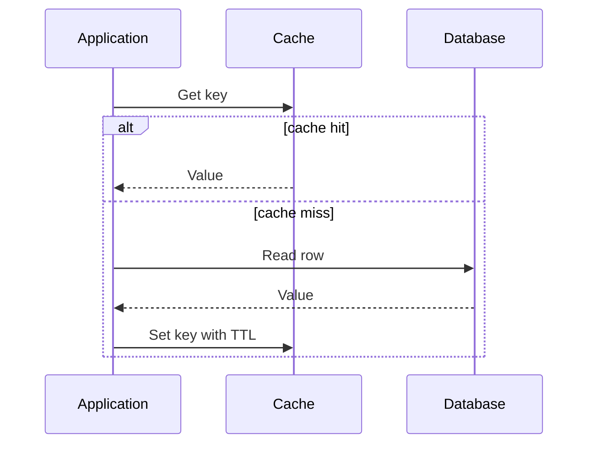

# Caching

A cache trades freshness and complexity for lower latency and reduced backend load. Cache data that is expensive to compute or fetch, read frequently, and safe to serve briefly out of date.

## Cache-aside

Choose a TTL from the acceptable staleness window. Add random jitter to large groups of expirations to avoid a synchronized load spike. Protect hot missing keys with request coalescing or a short-lived negative cache.

Invalidation is a consistency decision. You can expire, explicitly delete on writes, update through the cache, or accept bounded staleness. State which one your product permits.

