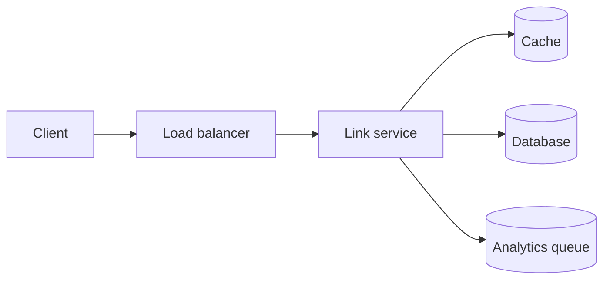

# Design a URL shortener

The system creates a compact code for a long URL and redirects visitors with low latency. Store the unique code, destination, owner, creation time, and optional expiry.

Redirect traffic is read-heavy, so use cache-aside with the code as the key. Generate codes with random Base62 values or encode distributed numeric identifiers; both approaches have collision, coordination, and predictability trade-offs.

Keep analytics asynchronous, rate-limit creation, protect against malicious destinations, and monitor redirect latency, cache hit ratio, invalid-code traffic, and database saturation.

