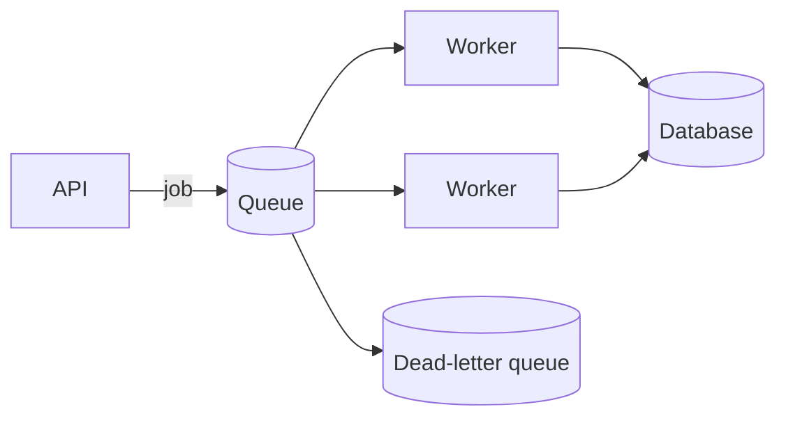

# Message queues

Queues decouple producers from consumers, absorb short traffic spikes, and move slow work out of the request path.

Assume messages can be delivered more than once unless the technology and end-to-end workflow prove otherwise. Consumers should be idempotent: processing the same message twice must not create duplicate business effects.

Set retry limits and exponential backoff. Move permanently failing messages to a dead-letter queue with enough context to investigate and replay them safely. Monitor queue depth, age of the oldest message, processing rate, and failure rate.

