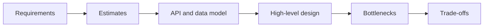

# Learn system design by reasoning

System design is the practice of turning an ambiguous product idea into a technical plan that can handle its expected load, remain available, and evolve safely. There is rarely one perfect answer. Good designs make their assumptions and trade-offs explicit.

## A repeatable design process

1. **Clarify requirements.** Separate core user actions from nice-to-have features.
2. **Name the quality goals.** Latency, availability, durability, consistency, cost, and security pull designs in different directions.
3. **Estimate scale.** Orders of magnitude are enough to reveal the likely bottlenecks.
4. **Define contracts and data.** Sketch APIs and the information the system owns.
5. **Draw the simplest complete design.** Trace one request from the client to durable storage.
6. **Find the pressure points.** Remove single points of failure and scale the hottest paths.
7. **Explain trade-offs.** Say what your design optimizes and what it deliberately gives up.

## Recommended path

Begin with [requirements and estimation](./fundamentals/requirements-estimation), then learn common building blocks such as [load balancing](./building-blocks/load-balancing), [caching](./building-blocks/caching), and [message queues](./distributed-systems/message-queues). Finally, apply the model in the [URL shortener case study](./case-studies/url-shortener).

:::tip Keep a decision log
For every major choice, write: **decision, reason, alternative, consequence**. That habit is more valuable than memorizing any architecture diagram.
:::
