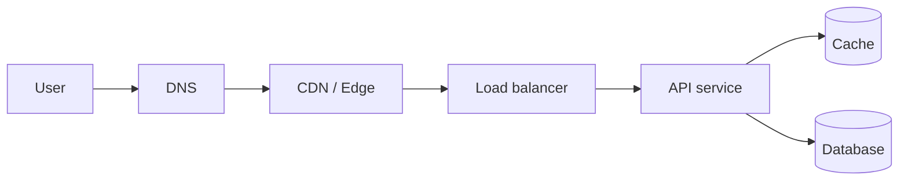

# Follow a request end to end

A system becomes easier to reason about when you can trace one request through it.

- **DNS** maps the hostname to an endpoint.
- **CDNs** serve cacheable content close to users and absorb traffic spikes.
- **Load balancers** spread connections or requests across healthy backends.
- **Services** perform authorization and business logic.
- **Caches and databases** return or persist state.

Each hop consumes part of the latency budget and can fail independently. Timeouts, retries, observability, and security boundaries should therefore be designed along the same path.

